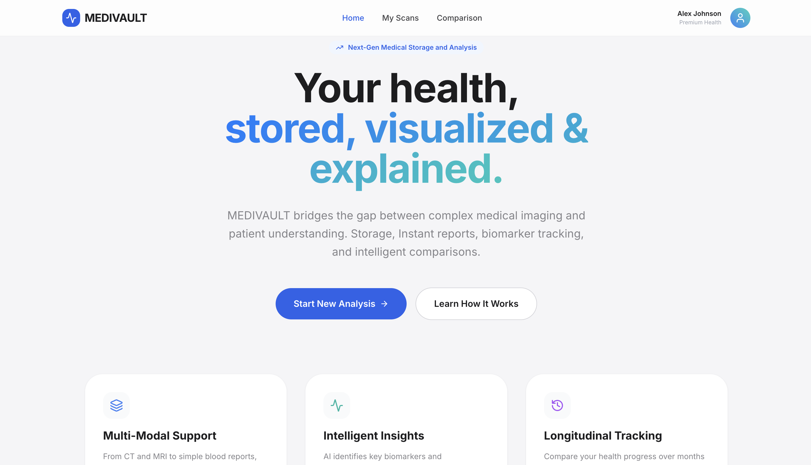
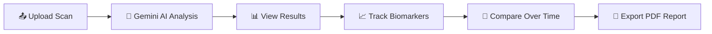

<div align="center">

# 🏥 MEDIVAULT

### *Your health, stored, visualized & explained.*

[](https://react.dev/)
[](https://www.typescriptlang.org/)
[](https://vitejs.dev/)
[](https://ai.google.dev/)
[](https://tailwindcss.com/)
[](LICENSE)

<br/>

**MEDIVAULT** bridges the gap between complex medical imaging and patient understanding.  
Upload your scans, get AI-powered analysis in plain language, track biomarkers over time, and make informed health decisions — all in one beautifully designed platform.

<br/>



<br/>
<br/>

</div>

---

## ✨ Features

<table>
<tr>
<td width="50%">

### 🔬 Multi-Modal Scan Support
Upload and analyze **CT scans, MRI, X-rays**, and **blood reports** — all from a single, unified interface. MEDIVAULT handles diverse medical imaging formats seamlessly.

</td>
<td width="50%">

### 🤖 AI-Powered Analysis
Powered by **Google Gemini AI**, receive instant, patient-friendly explanations of your medical scans. Understand what your results mean without a medical degree.

</td>
</tr>
<tr>
<td width="50%">

### 📊 Biomarker Tracking
Extracted metrics are displayed with interactive charts showing your values against standard reference ranges. Instantly see what's normal and what needs attention.

</td>
<td width="50%">

### 🔄 Longitudinal Comparison
Compare scans taken over time to track your health trajectory. The AI calculates percentage changes and provides **predictive analytics** forecasting future health trends.

</td>
</tr>
<tr>
<td width="50%">

### 📄 PDF Report Export
Generate professional, downloadable PDF reports of your analysis — perfect for sharing with your healthcare provider or keeping for your records.

</td>
<td width="50%">

### 🎨 Premium UI/UX
Smooth page transitions with **Framer Motion**, interactive data visualization with **Recharts**, and a clean design system built with **Tailwind CSS** and the **Inter** typeface.

</td>
</tr>
</table>

---

## 🛠️ Tech Stack

| Layer | Technology |
|-------|-----------|
| **Frontend Framework** | React 19 with TypeScript |
| **Build Tool** | Vite 6 |
| **AI Engine** | Google Gemini AI (`@google/genai`) |
| **Styling** | Tailwind CSS + Custom CSS |
| **Animations** | Framer Motion |
| **Charts** | Recharts |
| **Icons** | Lucide React |
| **PDF Export** | html2pdf.js |
| **Typography** | Inter (Google Fonts) |
| **Routing** | Hash-based SPA routing |

---

## 📁 Project Structure

```
MEDIVAULT/
├── index.html          # Entry point with importmap & global styles
├── index.tsx           # React root render
├── App.tsx             # Main app with routing & auth logic
├── types.ts            # TypeScript interfaces & enums
├── vite.config.ts      # Vite configuration
├── .env.example        # Environment variable template
├── components/
│   ├── Navbar.tsx      # Navigation bar with auth state
│   └── Footer.tsx      # Site footer
├── pages/
│   ├── Home.tsx        # Landing page with hero & feature cards
│   ├── Auth.tsx        # Login / Signup page
│   ├── UploadScan.tsx  # Scan upload with drag-and-drop
│   ├── AnalysisView.tsx # AI analysis results & biomarker charts
│   ├── ScanDashboard.tsx # Gallery of all uploaded scans
│   ├── CompareMode.tsx # Side-by-side scan comparison
│   └── About.tsx       # About / How it works page
├── services/
│   ├── gemini.ts       # Google Gemini AI integration (direct API calls)
│   ├── auth.ts         # Authentication service
│   └── mockDb.ts       # Local mock database
└── assets/
    └── homepage.png    # Homepage screenshot
```

---

## 🚀 Getting Started

### Prerequisites

- **Node.js** v18+ and **npm** installed
- A **Google Gemini API Key** ([Get one here](https://makersuite.google.com/app/apikey))

### Installation

```bash
# 1. Clone the repository
git clone https://github.com/swoyamsiddhi/MEDIVAULT1.git
cd MEDIVAULT1

# 2. Install dependencies
npm install

# 3. Set up environment variables
cp .env.example .env.local
# Edit .env.local and add your Gemini API key:
# VITE_GEMINI_API_KEY=your_api_key_here

# 4. Start the development server
npm run dev
```

The app will be running at **http://localhost:3000** 🎉

---

## 🔑 Environment Variables

| Variable | Description | Required |
|----------|-------------|----------|
| `VITE_GEMINI_API_KEY` | Google Gemini AI API key for scan analysis | ✅ Yes |

> **How to get an API key:** Visit [Google AI Studio](https://aistudio.google.com/apikey) and click "Create API Key".

---

## 📸 How It Works



1. **Upload** — Drag and drop or browse to upload your medical scan (CT, MRI, X-ray, or blood report).
2. **Analyze** — Gemini AI processes the image and returns a structured analysis with a patient-friendly summary, key observations, urgency score, and extracted biomarkers.
3. **Visualize** — View your metrics on interactive charts with reference ranges highlighted.
4. **Compare** — Select multiple scans to track changes over time with AI-driven trend analysis.
5. **Predict** — Get "Minority Report"-style predictive analytics forecasting future health outcomes based on current trends.
6. **Export** — Download a polished PDF report to share with your doctor.

---

## 🎯 Key AI Capabilities

| Capability | Description |
|-----------|-------------|
| **Scan Analysis** | Processes medical images and returns structured JSON with summary, observations, urgency score (1–10), and extracted biomarkers |
| **Metric Extraction** | Automatically identifies and extracts biomarkers with values, units, and reference ranges |
| **Health Status** | Classifies each metric as `Low`, `Normal`, or `High` |
| **Trend Analysis** | Calculates percentage changes between sequential scans and identifies clinically significant shifts (>10%) |
| **Predictive Forecasting** | Projects future health outcomes based on current metric trajectories over a 3-month horizon |

---

## 🤝 Contributing

Contributions are welcome! Here's how you can help:

1. **Fork** the repository
2. **Create** a feature branch (`git checkout -b feature/amazing-feature`)
3. **Commit** your changes (`git commit -m 'Add amazing feature'`)
4. **Push** to the branch (`git push origin feature/amazing-feature`)
5. **Open** a Pull Request

---

## ⚠️ Disclaimer

> MEDIVAULT is designed to **assist** in understanding medical reports — it is **not** a replacement for professional medical advice. Always consult a qualified healthcare provider for diagnosis and treatment decisions.

---

## 📄 License

This project is licensed under the **MIT License** — see the [LICENSE](LICENSE) file for details.

---

<div align="center">

**Built with ❤️ using React, TypeScript, and Google Gemini AI**

⭐ Star this repo if you found it helpful!

</div>
